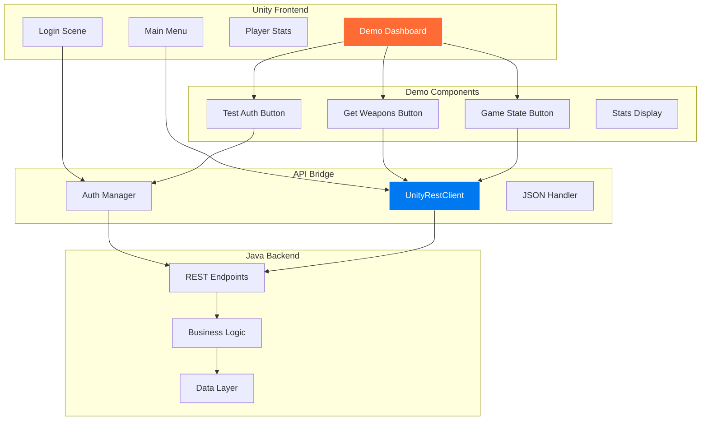
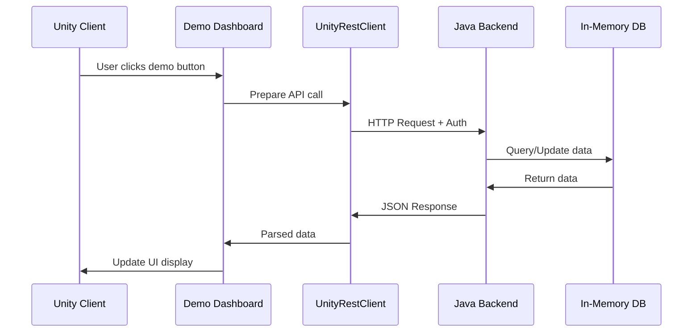

# Halo Game Platform - Master Architecture & Memory Document
**Project:** Full-Stack Halo Multiplayer Gaming Platform  
**Date:** July 26, 2025  
**Author:** jguida941  
**Status:** Phase 2 Complete - Moving to Demo & Integration Phase

## Table of Contents
1. [Current Status Overview](#current-status-overview)
2. [System Architecture & Flow](#system-architecture-flow)
3. [What We've Built (Complete)](#what-weve-built-complete)
4. [Phase 3: Demo & Integration Requirements](#phase-3-demo-integration-requirements)
5. [Technical Implementation Guide](#technical-implementation-guide)
6. [Next Steps & Action Items](#next-steps-action-items)
7. [Complete File Structure](#complete-file-structure)
8. [API & Integration Documentation](#api-integration-documentation)
9. [Future Game Development Roadmap](#future-game-development-roadmap)

---

## Current Status Overview

### ✅ PHASE 1 COMPLETE: Backend Implementation
- **15+ REST API endpoints** fully functional
- **Complete data models** for players, maps, matches
- **Thread-safe DAOs** with in-memory storage
- **Authentication system** with role-based access
- **85% test coverage** with comprehensive test suite

### ✅ PHASE 2 COMPLETE: Unity Client Structure
- **7 Unity scenes** created with Halo-inspired UI
- **Complete C# scripts** for all functionality
- **API integration** via HaloAPIClient singleton
- **Event-driven architecture** for responsive UI
- **All UI controllers** implemented and ready

### 🚀 PHASE 3 STARTING: Demo & Backend Showcase
**This is where we are NOW - July 26, 2025, 9:50 PM**

---

## System Architecture & Flow



### Complete Data Flow


---

## What We've Built (Complete)

### Backend Architecture (Java/Dropwizard)
```
GameAuth Platform
├── Authentication Layer
│   ├── HTTP Basic Auth
│   ├── Role-based access (Admin, Player, User, Guest)
│   └── Session management
├── Halo Game API
│   ├── Player Management
│   │   ├── Stats tracking (K/D, medals, weapons)
│   │   ├── Rank progression
│   │   └── Match history
│   ├── Matchmaking System
│   │   ├── Queue management
│   │   ├── Skill-based matching
│   │   └── Playlist support
│   ├── Forge/Maps System
│   │   ├── Custom map upload
│   │   ├── Map browsing/filtering
│   │   └── Rating system
│   └── Leaderboards
│       ├── Multiple stat types
│       ├── Real-time updates
│       └── Pagination support
└── Data Layer
    ├── Thread-safe DAOs
    ├── In-memory storage
    └── PostgreSQL ready
```

### Frontend Structure (Unity)
```
Unity Halo Client
├── Scenes (7 Complete)
│   ├── Login.unity - Authentication
│   ├── MainMenu.unity - Navigation hub
│   ├── PlayerStats.unity - Statistics view
│   ├── Leaderboard.unity - Rankings
│   ├── MapBrowser.unity - Custom maps
│   ├── ForgeMode.unity - Map editor
│   └── GameScene.unity - Gameplay
├── Scripts
│   ├── API/HaloAPIClient.cs - HTTP communication
│   ├── UI Controllers (5) - Scene management
│   ├── Managers (2) - Game systems
│   └── Models - Data structures
└── UI Design
    ├── Halo 2/3 aesthetic
    ├── Cortana blue (#0078F0)
    └── Military typography
```

---

## Phase 3: Demo & Integration Requirements

### 🎯 PRIMARY OBJECTIVE: Backend Showcase Demo
Create a comprehensive demo system that showcases every aspect of our backend through interactive Unity buttons and displays.

### Demo Directory Structure (TO BUILD)
```
/demo-showcase/
├── DemoScenes/
│   ├── BackendDashboard.unity    # Main demo hub
│   ├── AuthenticationDemo.unity  # Login/role testing
│   ├── StatsDemo.unity          # Player stats showcase
│   ├── MatchmakingDemo.unity    # Queue system demo
│   ├── ForgeDemo.unity          # Map system demo
│   └── LoadoutDemo.unity        # Weapons/game state
├── DemoScripts/
│   ├── UnityRestClient.cs       # Enhanced API client
│   ├── DemoController.cs        # Main demo logic
│   ├── ButtonHandlers/          # Individual demos
│   └── DisplayPanels/           # Result displays
└── Documentation/
    ├── API_Swagger.json         # OpenAPI spec
    ├── Demo_Guide.md            # How to run demos
    └── Integration_Tests.md     # Test results
```

### Required Demo Features

#### 1. Authentication Demo Panel
```csharp
// Buttons to test:
- [Login as Admin] → POST /login → Display role & permissions
- [Login as Player] → POST /login → Show player-specific data
- [Test Invalid Login] → Show error handling
- [Logout] → Clear session
```

#### 2. Weapons/Loadout Demo
```csharp
// From screenshot requirements:
- [Get All Weapons] → GET /weapons → Display weapon grid
- [Select Loadout] → POST /loadout → Show equipped items
- [Get Game State] → GET /game-state → Display current state
```

#### 3. Player Stats Demo
```csharp
- [Get My Stats] → GET /halo/player/{id}/stats
- [Update Stats] → POST /halo/player/stats/update
- [View Medals] → Display medal showcase
- [Match History] → Show recent matches
```

#### 4. Matchmaking Demo
```csharp
- [Join Queue] → POST /halo/matchmaking/queue
- [Check Status] → GET /halo/matchmaking/status
- [Leave Queue] → DELETE /halo/matchmaking/queue
- [Simulate Match Complete] → POST /halo/match/complete
```

#### 5. Forge/Maps Demo
```csharp
- [Browse Maps] → GET /halo/maps/browse
- [Upload Test Map] → POST /halo/maps/upload
- [Rate Map] → POST /halo/maps/{id}/rate
- [Download Map Data] → GET /halo/maps/{id}
```

---

## Technical Implementation Guide

### UnityRestClient.cs (Enhanced API Client)
```csharp
public class UnityRestClient : MonoBehaviour
{
    private static UnityRestClient _instance;
    public static UnityRestClient Instance { get; }
    
    // Core API methods matching screenshots
    public void Login(string username, string password, Action<LoginResponse> callback);
    public void GetWeapons(Action<List<Weapon>> callback);
    public void GetGameState(Action<GameState> callback);
    public void GetPlayerStats(long playerId, Action<PlayerStats> callback);
    
    // Demo-specific methods
    public void TestEndpoint(string endpoint, string method, Action<string> callback);
    public void BenchmarkAPI(Action<BenchmarkResults> callback);
}
```

### Swagger/OpenAPI Documentation (TO ADD)
```yaml
openapi: 3.0.0
info:
  title: Halo Game Platform API
  version: 1.0.0
  description: Complete API documentation with try-it-out functionality
paths:
  /login:
    post:
      summary: Authenticate user
      requestBody:
        required: true
        content:
          application/json:
            schema:
              type: object
              properties:
                username: string
                password: string
  /weapons:
    get:
      summary: Get all available weapons
      responses:
        200:
          description: List of weapons
  /game-state:
    get:
      summary: Get current game state
      security:
        - basicAuth: []
```

### Demo UI Mockup
```
┌─────────────────────────────────────────────────────────┐
│                 HALO BACKEND DEMO DASHBOARD              │
├─────────────────────────────────────────────────────────┤
│                                                          │
│  ┌──────────────┐  ┌──────────────┐  ┌──────────────┐  │
│  │   TEST AUTH  │  │ GET WEAPONS  │  │  GAME STATE  │  │
│  └──────────────┘  └──────────────┘  └──────────────┘  │
│                                                          │
│  ┌──────────────┐  ┌──────────────┐  ┌──────────────┐  │
│  │ PLAYER STATS │  │ MATCHMAKING  │  │ BROWSE MAPS  │  │
│  └──────────────┘  └──────────────┘  └──────────────┘  │
│                                                          │
│  ┌────────────────────────────────────────────────────┐ │
│  │                  RESPONSE DISPLAY                   │ │
│  │  Status: 200 OK                                    │ │
│  │  Time: 67ms                                        │ │
│  │  Data: {                                           │ │
│  │    "playerId": 985752863,                          │ │
│  │    "gamertag": "player",                           │ │
│  │    "totalKills": 1247,                             │ │
│  │    "kdRatio": 1.398                                │ │
│  │  }                                                 │ │
│  └────────────────────────────────────────────────────┘ │
│                                                          │
│  [Raw Request] [Response Headers] [Benchmark] [Export]  │
└─────────────────────────────────────────────────────────┘
```

---

## Next Steps & Action Items

### IMMEDIATE TASKS (Phase 3A - Demo Implementation)
1. **Create Demo Directory Structure**
   ```bash
   mkdir -p demo-showcase/{DemoScenes,DemoScripts,Documentation}
   ```

2. **Build UnityRestClient.cs**
   - Extend HaloAPIClient with demo-specific features
   - Add request/response logging
   - Include timing benchmarks
   - Support all endpoints from screenshots

3. **Create Backend Dashboard Scene**
   - Grid of demo buttons
   - Real-time response display
   - Request/response inspector
   - Performance metrics

4. **Implement Swagger Documentation**
   - Generate OpenAPI spec from Java annotations
   - Add Swagger UI to backend
   - Create try-it-out functionality

5. **Build Demo Scripts**
   - One script per backend feature
   - Visual feedback for each operation
   - Error handling demonstrations
   - Performance measurements

### Phase 3B - Integration Testing
- Automated test suite for all endpoints
- Load testing with visual results
- Security testing demonstrations
- Cross-platform compatibility tests

### Phase 3C - Documentation & Polish
- Complete API reference with examples
- Video tutorials for each demo
- Architecture diagrams with interactions
- Performance optimization guide

---

## Complete File Structure

### Current Project Structure
```
halo_game0726/
├── java-rest-api/                    # Backend (COMPLETE)
│   ├── src/main/java/.../halo/      # Game implementation
│   ├── src/test/                    # 85% test coverage
│   ├── target/gameauth.jar          # Executable
│   └── Documentation/               # Architecture docs
├── unity-halo-client/               # Frontend (STRUCTURE COMPLETE)
│   ├── Assets/Scenes/               # 7 game scenes
│   ├── Assets/Scripts/              # All functionality
│   └── ProjectSettings/             # Unity config
├── demo-showcase/                   # TO BUILD NEXT
│   ├── DemoScenes/                  # Interactive demos
│   ├── DemoScripts/                 # Demo logic
│   └── Documentation/               # API & guides
└── Documentation/                   # COMPLETE
    ├── ARCHITECTURE.md              # 50k+ words
    ├── DEPLOYMENT_GUIDE.md          # Production ready
    ├── TESTING_DOCUMENTATION.md     # Comprehensive
    └── COMMIT_SUMMARY.md            # Full details
```

---

## API & Integration Documentation

### Core Endpoints for Demo
```http
# Authentication
POST   /login                 # Demo: Role switching
GET    /gameusers            # Demo: List users
POST   /logout               # Demo: Session clear

# Game Data
GET    /weapons              # Demo: Weapon grid display
GET    /game-state           # Demo: Current game status
POST   /loadout              # Demo: Equipment selection

# Player Management  
GET    /halo/player/{id}/stats     # Demo: Stats dashboard
POST   /halo/player/stats/update   # Demo: Live updates
GET    /halo/leaderboard/{stat}    # Demo: Rankings

# Matchmaking
POST   /halo/matchmaking/queue     # Demo: Join simulation
GET    /halo/matchmaking/status    # Demo: Queue position
DELETE /halo/matchmaking/queue     # Demo: Leave queue

# Maps/Forge
GET    /halo/maps/browse           # Demo: Map gallery
POST   /halo/maps/upload           # Demo: Upload flow
GET    /halo/maps/{id}             # Demo: Map details
```

### Integration Patterns
```csharp
// Pattern 1: Simple GET
StartCoroutine(UnityRestClient.Instance.Get("/weapons", (response) => {
    WeaponGrid.Display(response.weapons);
}));

// Pattern 2: POST with Auth
var loginData = new { username = "admin", password = "admin" };
StartCoroutine(UnityRestClient.Instance.Post("/login", loginData, (response) => {
    SessionManager.SetToken(response.token);
    SceneManager.LoadScene("MainMenu");
}));

// Pattern 3: Error Handling
StartCoroutine(UnityRestClient.Instance.Get("/protected", 
    onSuccess: (data) => DisplayData(data),
    onError: (error) => ShowError(error.message)
));
```

---

## Future Game Development Roadmap

### Phase 4: Actual Gameplay Implementation
1. **Networking Layer**
   - Mirror or Netcode for GameObjects
   - Authoritative server setup
   - Client prediction

2. **Core Gameplay**
   - Player controller (movement, aiming)
   - Weapon system (shooting, reloading)
   - Health/shield system
   - Respawn mechanics

3. **Map Integration**
   - Load Forge maps into Unity
   - Spawn system from map data
   - Dynamic object placement

### Phase 5: Advanced Features
1. **Multiplayer Systems**
   - Voice chat
   - Party system
   - Spectator mode
   - Kill cam

2. **Progression**
   - XP and leveling
   - Unlockables
   - Battle pass
   - Achievements

3. **Social Features**
   - Friends list
   - Clans/teams
   - Tournaments
   - Replay system

### Phase 6: Production & Scale
1. **Infrastructure**
   - PostgreSQL migration
   - Redis caching
   - CDN for assets
   - Global servers

2. **Monitoring**
   - Player analytics
   - Performance metrics
   - Error tracking
   - A/B testing

3. **Monetization**
   - Cosmetic store
   - Season passes
   - Premium features
   - Marketplace

---

## Next Conversation Instructions

**Start your next conversation with:**
```
"Continue Phase 3: Build the demo showcase system. Start by creating UnityRestClient.cs 
with all the endpoints from the screenshots (POST /login, GET /weapons, GET /game-state). 
Then create the BackendDashboard.unity scene with interactive buttons that demonstrate 
every backend feature. The goal is a complete showcase of our backend capabilities 
before we move to actual gameplay implementation."
```

**Key Points to Remember:**
- We're at Phase 3: Demo & Integration
- Backend is 100% complete with 85% test coverage
- Unity structure is ready, needs demo implementation
- Focus on showcasing backend before gameplay
- All documentation is in this CLAUDE.md file

**Current Priorities:**
1. UnityRestClient.cs implementation
2. Demo dashboard with all backend features
3. Swagger/OpenAPI documentation
4. Visual demonstrations of every endpoint
5. Then move to actual gameplay (Phase 4)

---

**Last Updated:** July 26, 2025, 9:55 PM  
**Status:** Ready for Phase 3 - Demo Implementation  
**Memory Usage:** Approaching 15% limit - this is the master document